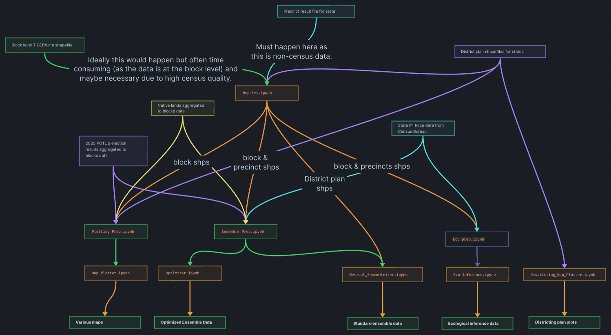

# Gabriel Dalton Final Project Code

### Flowchart for Data Processing Pipeline

Hello, welcome to my final project for Math195! This collection of notebooks was used to produce my writeup. "Native Americans and the Gingles Crieria." Above I have provided a flow chart of the pipeline used for data processing. All of the data I used is listed in Appendix A of my writeup with links provided in the footnotes. In addition, Appendix A also includes a general overview of how I processed the data. The writeup can be found here: [https://docs.google.com/document/d/1nGl8ZHofmnU4WB7BDV8aqEdgOBM4LbCpT9z3_DQ-l1s/edit?usp=sharing.](https://drive.google.com/file/d/1jozOywkD-3XLrJHiCRD9MNciFxmTFIus/view?usp=drive_link).

